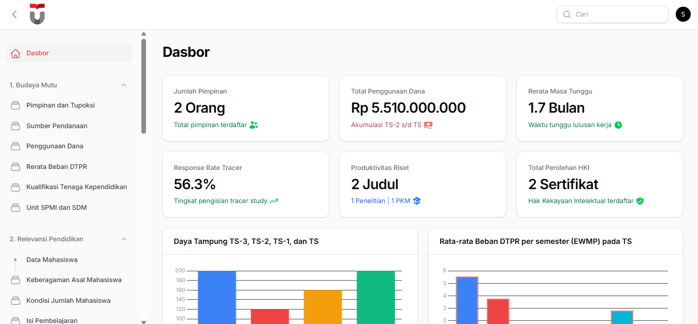

# SIGMA - Sistem Integrasi Mutu Akademik

  
  
  
  

**SIGMA** adalah platform Sistem Integrasi Mutu Akademik berbasis web yang dirancang untuk mengelola, memantau, dan melaporkan data akreditasi Program Studi secara efisien. Dibangun menggunakan **Laravel 12** dan **Filament PHP v4**, sistem ini mengintegrasikan seluruh kriteria akreditasi (9 Kriteria/LAM) ke dalam satu dasbor terpusat.

---

## 🚀 Fitur Utama

- **📊 Dashboard Analitik Real-time**: Visualisasi data penting seperti Rerata Masa Tunggu Lulusan, Produktivitas Riset DTPR, dan Tren Daya Tampung Mahasiswa.
- **📄 Export Laporan Multi-Sheet Excel**: Fitur sekali klik untuk menghasilkan file Excel komprehensif yang berisi banyak tab (sheet) sesuai format borang akreditasi standar (Data Mahasiswa, DTPR, Luaran, Capaian, dll).
- **🛠️ Manajemen Kriteria Lengkap**:
    - **Budaya Mutu**: Pengelolaan Visi Misi, SPMI, dan Sistem Tata Kelola.
    - **SDM & Mahasiswa**: Data Mahasiswa Baru/Aktif, Beban Kerja DTPR (EWMP), dan Kualifikasi Tendik.
    - **Penelitian & PKM**: Pembiayaan, Kerjasama, Luaran HKI, dan Publikasi Ilmiah.
    - **Output & Capaian**: Tracer Study, Masa Tunggu Lulusan, dan Kesesuaian Bidang Kerja.
- **📂 Sistem Bukti Digital**: Pengelolaan tautan (URL) dan file dokumen bukti yang terorganisir untuk mempermudah proses audit eksternal.
- **🔒 Custom Authentication**: Halaman login yang dipersonalisasi sesuai branding institusi SIGMA.

---

## 🛠️ Tech Stack

- **Framework:** [Laravel 12](https://laravel.com)
- **Admin Panel:** [Filament PHP v4](https://filamentphp.com)
- **Export Engine:** [Laravel Excel (Maatwebsite)](https://laravel-excel.com)
- **PDF Engine:** [Laravel-DomPDF (Barryvdh)](https://github.com/barryvdh/laravel-dompdf)
- **Database:** MySQL
- **Frontend:** Tailwind CSS & Vite

---

## 🖥️ Tampilan Dashboard

  

